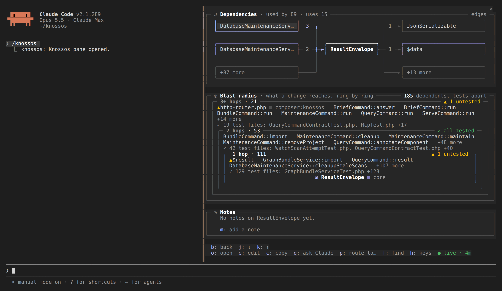
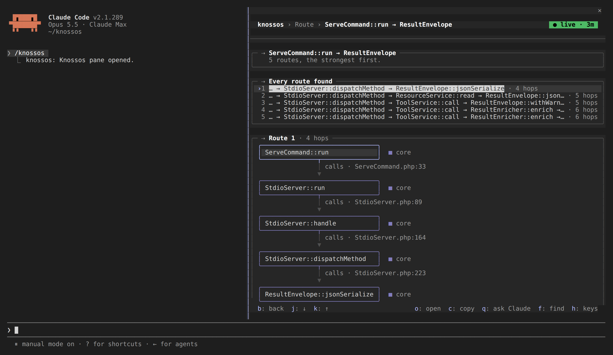
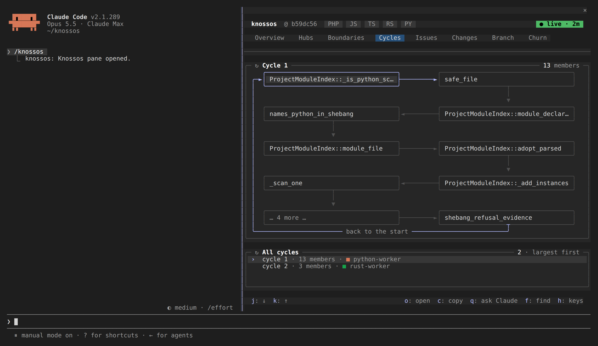
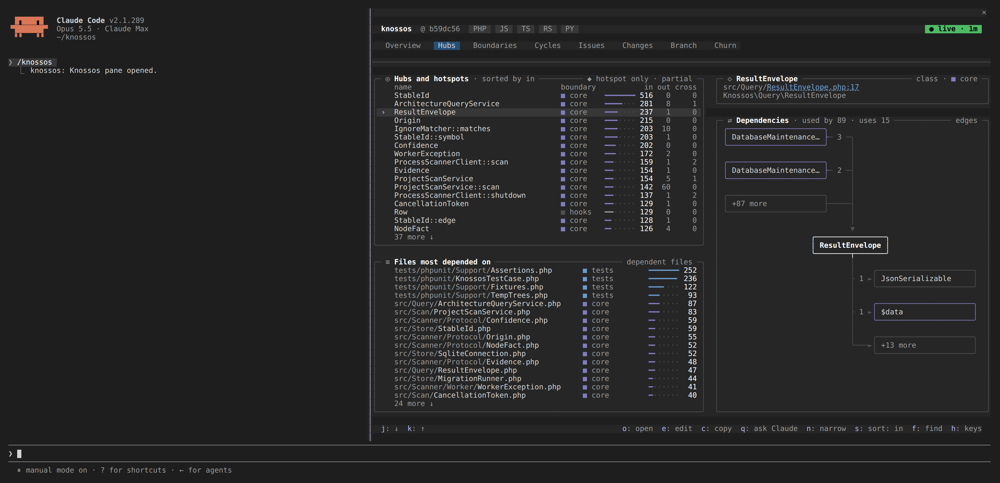

# Structure analysis

Five tools walk the graph instead of listing it: what depends on a symbol, how
one component reaches another, which modules are tangled, where the structural
hotspots are, and where new code belongs. What the graph holds, and how far to
trust each fact, is on [the graph and its evidence](graph-and-evidence.md).
Full input schemas are in the [MCP tool reference](../reference/mcp-tools.md).

| Tool                  | CLI                   | Answers                                                     |
| --------------------- | --------------------- | ----------------------------------------------------------- |
| `impact_analysis`     | `impact-analysis`     | What depends on a symbol, with the edge that proves it.     |
| `explain_flow`        | `explain-flow`        | How A reaches B, as ranked evidence-backed paths.           |
| `dependency_cycles`   | `dependency-cycles`   | Circular dependencies as bounded strongly connected groups. |
| `architecture_health` | `architecture-health` | Hubs, hotspots, and dead-code candidates.                   |
| `suggest_location`    | `suggest-location`    | Where new code for a feature belongs.                       |

Each tool takes the bounds that make sense for it: `max_depth` or
`max_nodes`/`max_edges` cap the walk, `timeout_ms` caps the time,
`min_confidence` filters weaker static facts (it never upgrades them), and
`edge_kinds` narrows which relationships count. Exceeding a bound sets
`truncated` on the [envelope](../reference/response-envelopes.md) and records
why in `bounds`, so a partial answer never passes for a complete one.

## Impact analysis

Use `impact_analysis` before you change a symbol. It walks the graph backwards
from the symbol to everything that statically depends on it, up to `max_depth`
(1–8, default 4) hops.

```sh
knossos impact-analysis project_... 'Knossos\Scanner\ScannerClient' --json
```

`dependants` is a flat, BFS-ordered list rather than grouped by distance, so
sort or filter on `distance` and `path_confidence` yourself. Each entry carries
the `via` edge that justifies it, with its `origin`, `confidence` and the
`evidence` location (`path`, `start_line`, `end_line`), so the answer is
checkable instead of asserted. Over MCP the default `compact` verbosity
collapses `via` to the edge kind. Ask for `verbosity: "full"`, or use `--json`
on the CLI, to get the whole edge. `counts` breaks the result down
`by_distance` and `by_confidence`, and `entry_points` lists the ways into the
system among the dependants: routes, commands and endpoints, and classes
classified as a controller, a command or an entry point. Test code is never an
entry point. This is the same definition the agent brief and the session brief
use, so all three name the same components.

The result always carries the warning "Impact is a conservative static blast
radius; it does not guarantee that a dependant will break." Reflection,
configuration-driven wiring and dynamic dispatch are invisible to a static
scan.

The pane draws the same walk as rings around the component:



## Explain flow

Use `explain_flow` to answer "how does a request here reach code there?". It
traces static paths between two components and returns up to `max_paths` (1–20,
default 5) of them within `max_depth` (1–8, default 6) hops.

```sh
knossos explain-flow project_... 'App\Http\CheckoutController' 'App\Billing\InvoiceGenerator' --json
```

Each path holds its `nodes`, its `hops` and a `score`. A hop is an edge with
the same evidence a single relationship carries. Paths are ranked by their
weakest edge first, then by fewest hops, so a short chain of certain edges
beats a short chain of guesses. Only flow relationships
count (`routes_to`, `calls`, `dispatches`, `handles`, `listens_to`,
`constructs`, `injects`, `binds`, `observes`, `depends_on`, `imports` and
`uses_middleware`), so a link through `extends` or `implements` is not a path.

A pair with no static path returns an empty `paths` list rather than an error.
That is a real answer, though it proves nothing about the runtime.

The search is bounded by `timeout_ms`, by 10,000 states visited and by 10,000
states queued, so one component with thousands of callees cannot exhaust it.
When a bound cuts the search, `truncated` is true, `bounds.truncation_reasons`
names each bound met (`time_limit`, `visit_limit`, `queue_limit` and others),
and the summary says the search was truncated. An empty `paths` list from a
truncated search means none were found before that bound, not that none exist.



## Dependency cycles

Use `dependency_cycles` before a refactor to see which modules are tangled. It
reports circular dependencies as bounded strongly connected groups rather than
one enumerated cycle per path, which keeps the output proportional to the
tangle instead of exponential in it.

```sh
knossos dependency-cycles project_... --limit=20 --json
```

Self-loops are excluded unless you pass `--include-self-loops`: a recursive
function is a real self-edge and almost never what someone hunting circular
imports is looking for. An import that only the compiler needs, such as a
TypeScript `import type`, is erased at runtime and does not count, so a loop
closed only by such imports is not reported. The result says so in its
`warnings`.

The default bounds cover the whole graph of most projects: `max_nodes`
(default 50,000) counts only the symbols that take part in a selected
relationship, and `max_edges` defaults to 100,000. The search reads bare
endpoint pairs first and loads names, files and lines only for the cycles it
reports, so a graph of tens of thousands of relationships is searched well
inside the default `timeout_ms` of one second. When a bound does stop the
search, the summary names it, and the Claude Code pane shows the count as `?`
rather than `0+` when nothing was found before the stop. A cycle that runs
through an edge whose node no longer exists, which only a graph written before
foreign keys were enforced can hold, lists the members it could load and is
marked truncated with `missing_detail`.



## Architecture health

Use `architecture_health` to decide where cleanup or extra test coverage pays
off most. One call ranks the hubs (the most depended-on components), the
`static_hotspots`, and the `dead_code_candidates`, and adds an
`in_degree_histogram`. Test-role components and, unless
`include_tests`/`include_external` say otherwise, external and unresolved
components are left out of the rankings: an unfiltered hub list is dominated by
framework symbols and says nothing about your own structure. `bounds` counts
what was left out, so the filtering is auditable.

```sh
knossos architecture-health project_... --limit=20 --json
```

A hub's score is its degree, the number of edges in and out. A hotspot adds
twice its cross-boundary degree, plus three if it takes part in a cycle.
The cycle check runs with the same `max_nodes` (default 50,000) and
`max_edges` as the rest of the call, inside what is left of `timeout_ms`;
when it is cut short, `bounds.cycle_scan_truncated` says so.
Hotspots are static structural signals and predict neither change frequency nor defects. For that, read [change review](change-review.md).

The dead-code half of the result is the subtlest thing Knossos reports. It
splits what nothing references from what only tests reach. What it excludes
before reporting, and why, is in [dead-code candidates](dead-code-candidates.md).



## Suggest location

Use `suggest_location` to find where new code belongs. It ranks existing
boundaries by how well a described feature fits them, so a new file lands
somewhere cohesive instead of wherever the author happened to be.

```sh
knossos suggest-location project_... "refund a completed checkout" --json
```

Each candidate shows its `factors` (name, member and role relevance, and
internal dependency cohesion) next to the score, so a ranking you disagree with
can be argued with. The `ranking` block says which mode was applied.

### Optional semantic ranking

`suggest_location` defaults to `ranking_mode: deterministic`. This mode is
offline, reproducible, inspectable and always available.

Library integrators can inject an implementation of
`Knossos\Query\SemanticRanker` into `ArchitectureQueryService` and request
`semantic_if_available` through the MCP tool or the service. The provider
receives only the bounded feature text and candidate boundary text, and must
return one finite normalized score from 0 through 1 for every candidate within
the supplied timeout. Knossos adds at most 20 semantic points to the
deterministic score and reports the provider, the applied mode and a
`semantic_relevance` factor.

The packaged CLI and MCP runtime configure no external provider on purpose, so
an opt-in semantic request reports `provider_unavailable` and returns the exact
deterministic ordering. Missing or extra candidates, non-numeric or
out-of-range scores, exceptions and deadline overruns produce the same
fallback, with a `provider_failed` reason cut to 200 bytes. Project code
is never sent to a provider or executed by the core. A custom provider is
responsible for its own data-handling policy.
