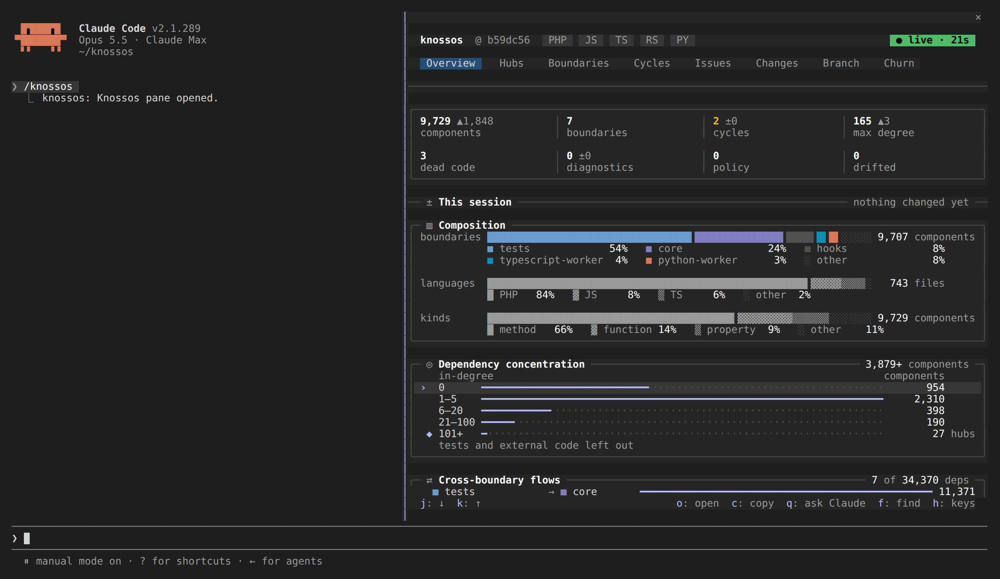

# First scan

You have Knossos [installed](installation.md). This page takes you from there to
a graph of one of your projects, checks that the graph is there, and points you
at the two places to use it.

## Scan a project

Point `knossos scan` at the project's directory. If you registered the server
through `tools/install`, export the same data directory first, so the CLI and
the server read one graph (see
[one data directory](installation.md#one-data-directory)):

```sh
export KNOSSOS_DATA_DIR="$HOME/.knossos"
bin/knossos scan /absolute/path/to/your-project
```

The scan reads source files only. It never installs dependencies, runs your
code or boots a framework. It prints the size of the graph and the ids you need
for later calls:

```text
Scanned 212 files into 1480 nodes and 3105 relationships.
Project: project_5a21f82c...
Snapshot: scan_3a08192c...
```

A node is a component the scanners found (a class, a method, a route, a
module). A relationship is an edge between two of them: a call, an import, an
inheritance link. Your counts will differ.

The default mode, `auto`, scans everything the first time and rescans only what
changed afterwards.
If the project has a [`knossos.json`](project-configuration.md) in its root, the
scan reads it for ignores, boundaries and limits.

A project that is not a Git repository scans fine. The scan prints one line
saying Git could not answer, and `change_impact` still returns the static
impact.

## Check that it worked

List the projects in the data directory:

```sh
bin/knossos list-projects
```

```text
Found 1 persisted project.
project_5a21f82c...  your-project  ready  files=212 nodes=1480 edges=3105
```

`ready` means the active snapshot is complete. Then ask the graph something.
`architecture-summary` returns the boundaries and the hubs, and
`export-agent-brief` renders the same orientation as markdown:

```sh
bin/knossos architecture-summary project_5a21f82c...
bin/knossos export-agent-brief project_5a21f82c...
```

If the brief lists the boundaries and hubs you expect, the scan worked. If it is
empty or the language mix is wrong, run `bin/knossos doctor` to check that every
worker starts, and check [the ignore list](project-configuration.md#settings) in
case a directory you care about is excluded by default.

From inside a project you can skip the id. `session-brief`, `dashboard` and the
other path-addressed commands read the database `KNOSSOS_DATA_DIR` names, or,
when it is unset, the nearest `.knossos/knossos.sqlite` at or above the path:

```sh
cd /absolute/path/to/your-project
bin/knossos session-brief
```

## A worked example

The output below is real, from a scan of the Knossos repository itself, abridged
with `…`. The scan reports what each language worker read:

```console
$ bin/knossos scan . --json
{"summary":"Scanned 743 files into 11054 nodes and 65870 relationships.",
 "data":{"files":743,"nodes":11054,"edges":65870,"diagnostics":0,"mode":"full",
 "scanner_metadata":{"knossos.php":{"files_scanned":621},
   "knossos.typescript":{"files_scanned":106,"programs":5, …},
   "knossos.python":{"files_scanned":7,"parser":"python.ast"},
   "knossos.rust":{"files_scanned":9,"parser":"rust.syn"}}, …}}
```

Orient yourself in a codebase you have never opened:

```console
$ bin/knossos architecture-summary project_1b4f41… --json
{"summary":"Knossos-MCP contains 11054 nodes and 65870 relationships.",
 "data":{"node_kinds":[{"kind":"method","count":6379},{"kind":"function","count":1391},
   {"kind":"property","count":849},{"kind":"class","count":726}, …],
  "edge_kinds":[{"kind":"calls","count":43552},{"kind":"contains","count":8827},
   {"kind":"references","count":5888}, …]}}
```

Ask what breaks if you change an interface. Each of its dependents carries the edge that
justifies it and the exact source line, so you can check the answer:

```console
$ bin/knossos impact-analysis project_1b4f41… 'Knossos\Scanner\ScannerClient' --json
{"summary":"Found 100 potential static dependants within depth 4.",
 "data":{"target":{"kind":"interface","canonical_name":"Knossos\\Scanner\\ScannerClient", …},
   "dependants":[{"node":{"canonical_name":"Knossos\\Scanner\\Worker\\ProcessScannerClient", …},
     "distance":1,"path_confidence":"certain",
     "via":{"kind":"implements","origin":"ast",
       "explanation":"ProcessScannerClient depends through --implements (certain, ast)--> ScannerClient",
       "evidence":{"path":"src/Scanner/Worker/ProcessScannerClient.php","start_line":11}}}, …],
   "counts":{"by_distance":{"1":5,"2":22,"3":73},
     "by_confidence":{"certain":100,"probable":0,"possible":0}}, …},
 "warnings":["Impact is a conservative static blast radius; it does not guarantee that a dependant will break."]}
```

Find refactor targets without `wc` and `find`:

```console
$ bin/knossos file-metrics project_1b4f41… --limit=3 --json
{"summary":"3 of 743 files by line_count desc.",
 "data":{"files":[{"path":"workers/typescript/src/scanner.js","language":"javascript","line_count":5077},
   {"path":"src/Discovery/ProjectDiscoverer.php","language":"php","line_count":2835},
   {"path":"tests/phpunit/Reconciliation/GraphReconcilerTest.php","language":"php","line_count":2760}]}}
```

Answers that rest on inference say so: the impact warning above, and dead-code
candidates that report an absence of evidence. Over MCP the same calls default
to a compact verbosity that names each component once, and the saving grows
with the result; see [response envelopes](../reference/response-envelopes.md#verbosity).

## Let the server read it

The CLI scans any directory you give it. The MCP server answers only for
directories on its allow-list, and a project you scanned from the shell is not
on it until you add it:

```sh
bin/knossos allow-root /absolute/path/to/your-project --execute
```

Without `--execute` the command previews the change. The server re-reads the
roots file on every request, so the grant takes effect without a restart. When
a path is rejected, call `server_info`: it names the roots in force and the file
to extend.

## Next step



Where you use the graph decides what you set up next.

- **You work in Claude Code.** Install [the plugin](../claude-code/plugin.md).
  It injects a [session brief](../claude-code/session-brief.md) at the start of
  each session and adds the architecture pane, where you browse hubs, cycles,
  boundaries and the diff of a turn. [The pane page](../claude-code/pane.md)
  shows how to open it.

- **You use another agent or a script.** Register the MCP server as described
  in [installation](installation.md#native-stdio-repository-checkout) and read
  [agent integration](../agents/agent-integration.md) for the tools an agent
  calls first. The full list is in
  [the MCP tool reference](../reference/mcp-tools.md).

- **You want the graph kept current.** Run
  [watch mode](../operate/watch-mode.md), or let a read tool rescan a stale
  graph on its own, as
  [agent integration](../agents/agent-integration.md#refreshing-a-stale-graph)
  describes.
